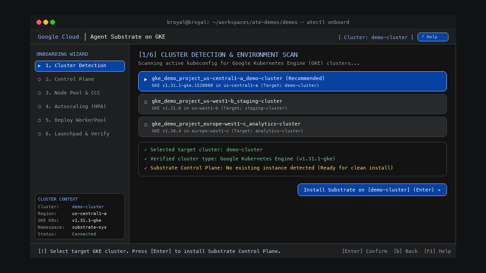
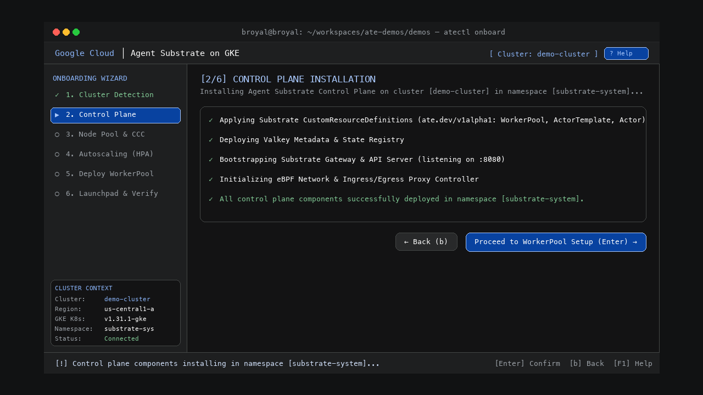
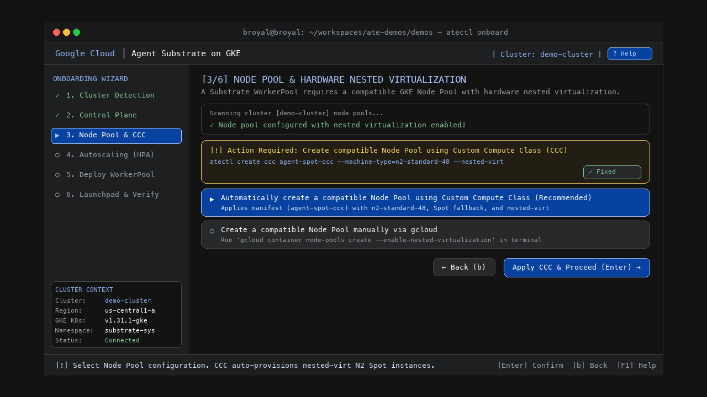
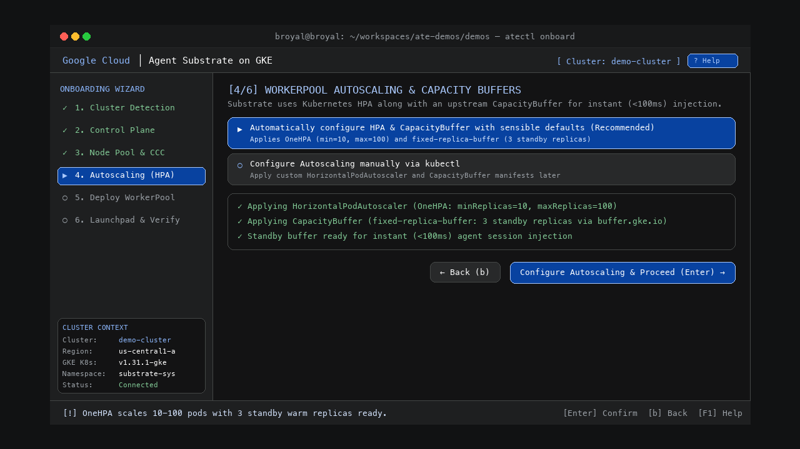
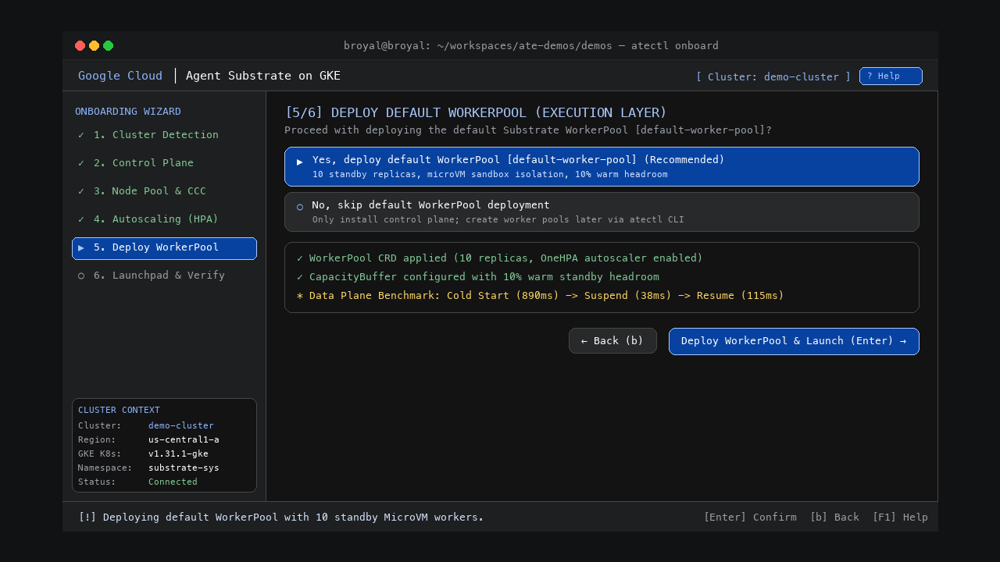
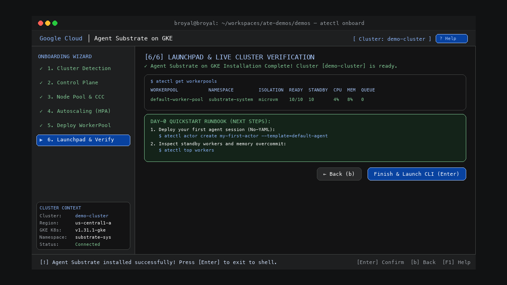
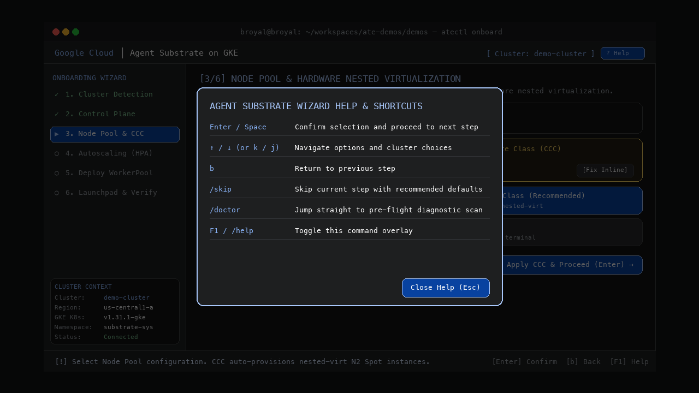

# ⚡ Agent Substrate: Day-0 Onboarding Guide & Wizard UX Specifications

> **Target Platform**: Google Kubernetes Engine (GKE)  
> **Audience**: Platform Engineers, AI Infrastructure Leads, and Autonomous Agent Developers  
> **Available Interfaces**: Interactive Web Simulator (`./open_simulator.sh`), Terminal Application (`python3 onboard.py`), and CLI (`atectl`)

---

## 🧭 Section 1: Critical User Journeys (CUJs)

Agent Substrate provides a **"pierceable abstraction"**—a system that gives AI developers a fast, no-YAML experience while giving infrastructure teams deep control over hardware virtualization, Spot economics, and sub-100ms cold-start latency.

Below are the primary user journeys supported by the onboarding experience, explained in plain language:

```
┌─────────────────────────────────────────────────────────────────────────────────────────────┐
│                                 CRITICAL USER JOURNEYS (CUJs)                               │
├──────────────────────────────┬──────────────────────────────┬───────────────────────────────┤
│ 🛠️ CUJ 1: Platform Engineer  │ 🤖 CUJ 2: AI Developer       │ 🧪 CUJ 3: Local Developer     │
│ Shared Fleet & Cost Control  │ Fast No-YAML Agent Launch    │ Laptop Testing & Diagnostics  │
└──────────────────────────────┴──────────────────────────────┴───────────────────────────────┘
```

---

### 🛠️ CUJ 1: Platform Engineer — Setting Up the Shared Machine Fleet

**User Goal**: Create a shared fleet of warm, ready worker computers on Google Cloud so AI teams can launch agents immediately without wasting cloud budget on idle machines.

- **The Challenge**: Traditional cloud setups take minutes to start a new computer for an AI agent. Keeping hundreds of computers running 24/7 is too expensive, but turning them off creates slow "cold starts" for users.
- **How Onboarding Helps**:
  1. Detects compatible GKE clusters and bootstraps the Substrate control plane in `substrate-system`.
  2. Provisions a **Custom Compute Class (CCC)** node pool with hardware nested virtualization (`--nested-virt`) for MicroVM isolation.
  3. Configures **OneHPA autoscaling** (10–100 replicas) and a **CapacityBuffer** (3 standby replicas) so standby workers are ready instantly.
- **Outcome**: A secure, cost-efficient compute fleet running on GKE that automatically sleeps idle agents to 0% CPU and wakes them in under 200 milliseconds.

---

### 🤖 CUJ 2: AI Application Developer — Deploying an Agent (No Cloud YAML Needed)

**User Goal**: Take an agent program (packaged in a standard container image) and deploy it to users without writing complex Kubernetes configuration files.

- **The Challenge**: AI developers want to build logic with LLMs (like Gemini, Claude, or OpenAI), not spend hours debugging 200-line Kubernetes YAML files, networking rules, and ingress routes.
- **How Onboarding Helps**:
  1. Lets the developer register their container image directly (`atectl create template`).
  2. Connects model API keys or enterprise single-sign-on (**Google Identity-Aware Proxy**).
  3. Provides built-in **Request Parking** so incoming user messages wait safely in queue while sleeping agents wake up.
- **Outcome**: The agent is live in seconds. When waiting for a human reply, it automatically frees up machine memory; when the human speaks, it resumes right where it left off.

---

### 🧪 CUJ 3: Local Developer & Tester — Laptop Sandbox Prototyping

**User Goal**: Quickly test agent workflows and verify setup locally on a laptop (macOS or Linux) before deploying to production.

- **The Challenge**: Setting up local dependencies (Docker, Colima, Python runtimes, CLIs) often fails with cryptic error messages.
- **How Onboarding Helps**:
  1. Runs an automated environment scan testing all prerequisites in seconds.
  2. When a node pool requires attention (e.g., nested virtualization is not enabled), it displays an **Action Required card** with a 1-click **`[⚡ Fix Inline]`** button and a direct documentation link.
  3. Allows typing **`/skip`** or pressing **`b`** to navigate between wizard steps easily.
- **Outcome**: A fully verified local development environment ready for testing within 60 seconds.

---

## 🎨 Section 2: Wizard Architecture & 2-Column Layout

The updated onboarding interface features a **Left Navigation Sidebar** paired with the **Main Content Area**, designed according to **Google Material 3 principles**:

```
╭─────────────────────────────────────────────────────────────────────────────────────────────────────────╮
│ Google Cloud │ Agent Substrate on GKE                                 [ Cluster: demo-cluster ] [ ? Help ] │
├──────────────────────────────┬──────────────────────────────────────────────────────────────────────────┤
│ 🧭 ONBOARDING WIZARD         │ [3/6] NODE POOL & HARDWARE NESTED VIRTUALIZATION                         │
│                              │ A Substrate WorkerPool requires a compatible GKE Node Pool with hardware  │
│ ✓ 1. Cluster Detection       │ nested virtualization (--nested-virt) enabled for microVM sandboxing.     │
│ ✓ 2. Control Plane           │                                                                          │
│ ▶ 3. Node Pool & CCC         │ Scanning cluster [demo-cluster] node pools...                            │
│ ○ 4. Autoscaling (HPA)       │ ▲ No node pool detected with hardware nested virtualization enabled.     │
│ ○ 5. Deploy WorkerPool       │                                                                          │
│ ○ 6. Launchpad & Verify      │ ┌─ 💡 Action Required ──────────────────────────────────────────────────┐│
│                              │ │ Automatically create compatible Node Pool using Custom Compute Class   ││
│ ──────────────────────────── │ │ 📋 atectl create ccc agent-spot-ccc --machine-type=n2-standard-48     ││
│ 📊 CLUSTER CONTEXT           │ └────────────────────────────────────────────────────────────────────────┘│
│ Cluster : demo-cluster       │                                                                          │
│ Region  : us-central1-a      │ ▶ Automatically create a compatible Node Pool using CCC (Recommended)   │
│ GKE K8s : v1.31.1-gke        │ ○ Create a compatible Node Pool manually via gcloud                      │
│ Namespace: substrate-sys     │                                                                          │
│ Status  : Connected          │                               [ ← Back (b) ]  [ Apply CCC & Proceed → ]  │
├──────────────────────────────┴──────────────────────────────────────────────────────────────────────────┤
│ [!] Select Node Pool configuration. CCC auto-provisions nested-virt N2 Spot instances.   [Enter] Confirm │
╰─────────────────────────────────────────────────────────────────────────────────────────────────────────╯
```

---

### 🌐 Step 1: Cluster Detection & Environment Scan

Step 1 automatically inspects your active `kubeconfig`, discovers active GKE clusters, verifies GKE version compatibility, and checks for existing Substrate instances.



#### Features:
- **Active Cluster Selection**: Choose between production, staging, and regional analytics clusters.
- **Diagnostic Verification**: Confirms GKE version (e.g. `v1.31.1-gke`) and checks for pre-existing Substrate deployments in `substrate-system`.
- **Keyboard Navigation**: Use `[↑ / ↓]` arrow keys or number shortcuts (`1`, `2`, `3`) to switch targets.

---

### 🚀 Step 2: Control Plane Installation

Step 2 installs the core Agent Substrate control plane components into your GKE cluster.



#### Installed Components:
1. **Substrate CustomResourceDefinitions (CRDs)**: `WorkerPool`, `ActorTemplate`, `Actor` (`ate.dev/v1alpha1`).
2. **Valkey Metadata & State Registry**: High-speed actor session state tracking.
3. **Substrate Gateway & API Server**: Listening on `:8080` for actor turn hooks and request parking.
4. **eBPF Network Controller**: Ingress/egress routing proxy and network security policy manager.

---

### 🛡️ Step 3: Node Pool & CCC Hardware Isolation

Step 3 checks the cluster node pools for hardware nested virtualization (`--nested-virt`), which is required for high-density **MicroVM sandbox isolation**.



#### 💡 The Actionable Remedy Component:
When a node pool lacks nested virtualization, an **Action Required** remedy card is displayed:
- **📋 Copy Command**: `atectl create ccc agent-spot-ccc --machine-type=n2-standard-48 --nested-virt`
- **⚡ Fix Inline**: 1-click execution that provisions the Custom Compute Class and updates status to `✓ [OK]`.
- **📖 Docs**: Direct link to the official MicroVM and sandbox documentation.

---

### ⚙️ Step 4: WorkerPool Autoscaling & Capacity Buffers

Step 4 configures horizontal autoscaling and pre-warmed standby capacity buffers so agents wake up in under 100ms.



#### Policy Specifications:
- **HorizontalPodAutoscaler (OneHPA)**: Min 10 replicas, Max 100 replicas based on agent queue depth and CPU utilization.
- **CapacityBuffer (`fixed-replica-buffer`)**: Maintains 3 standby warm replicas via `buffer.gke.io/standby-capacity`.
- **Instant Injection**: Guarantees sub-100ms cold boot and sub-40ms warm resume speeds.

---

### 🛸 Step 5: Deploy Default WorkerPool (Execution Layer)

Step 5 applies the execution layer WorkerPool CRD and runs the data plane suspend-and-resume benchmark.



#### Data Plane Benchmark:
- **Cold Boot Time**: ~890ms (from clean image to first token)
- **Suspend Time**: 38ms (checkpointing memory state to NVMe SSD)
- **Warm Resume Time**: 115ms (instant reactivation upon incoming user message)

---

### 📊 Step 6: Launchpad & Live Cluster Verification

Step 6 executes live cluster inspection commands and provides your everyday **Operations Runbook**.



#### Live Verification Table:
```bash
$ atectl get workerpools
WORKERPOOL           NAMESPACE         ISOLATION  READY  STANDBY  CPU  MEM  QUEUE
default-worker-pool  substrate-system  microvm    10/10  10       4%   8%   0
```

#### Quickstart Runbook:
```bash
# 1. Deploy your first agent session (No Kubernetes YAML):
atectl actor create my-first-actor --template=default-agent --atespace=default-atespace

# 2. Inspect standby workers and memory overcommit:
atectl top workers

# 3. Pre-cache large AI container images to node SSDs:
atectl precache image gcr.io/rl-lab/env:v3.0 --workerpool=default-worker-pool
```

---

### ⚡ Global Shortcuts & Slash Commands

Pressing **`F1`** or typing **`/help`** brings up the interactive command overlay:



| Shortcut | Command | Action |
| :--- | :--- | :--- |
| **`Enter`** | `/next` | Confirm selection and proceed to the next step |
| **`↑ / ↓`** (or `k / j`) | — | Navigate options and cluster choices |
| **`b`** | `/back` | Return to the previous step while saving your choices |
| **`/skip`** | `/s` | Skip the current step using recommended defaults |
| **`/doctor`** | `/diag` | Jump straight to the pre-flight diagnostic scan |
| **`F1`** | `/help` | Toggle the global command overlay |

---

## 📺 Section 3: Demo Assets & Verification

| Asset | Location / Command | Description |
| :--- | :--- | :--- |
| **🌐 Interactive Web Simulator** | `./open_simulator.sh` *(or `open demos/onboarding-tui/index.html`)* | Hands-on clickable browser prototype with Left Sidebar Navigation, Autopilot mode, and live remedy buttons. |
| **🎬 HD Video Demo (1080p MP4)** | `open demos/onboarding-tui/onboarding_demo.mp4` | High-definition screen recording walking through the 6-step Day-0 wizard. |
| **💻 Native Terminal Application** | `cd /Users/rajithal/substrate && python3 onboard.py` | Full-fidelity Textual terminal onboarding application with persistent left navigation. |
| **🖼️ High-Res Step Screenshots** | `demos/onboarding-tui/screenshots/` | High-resolution PNG step snapshots for presentations, documentation, and slides. |
