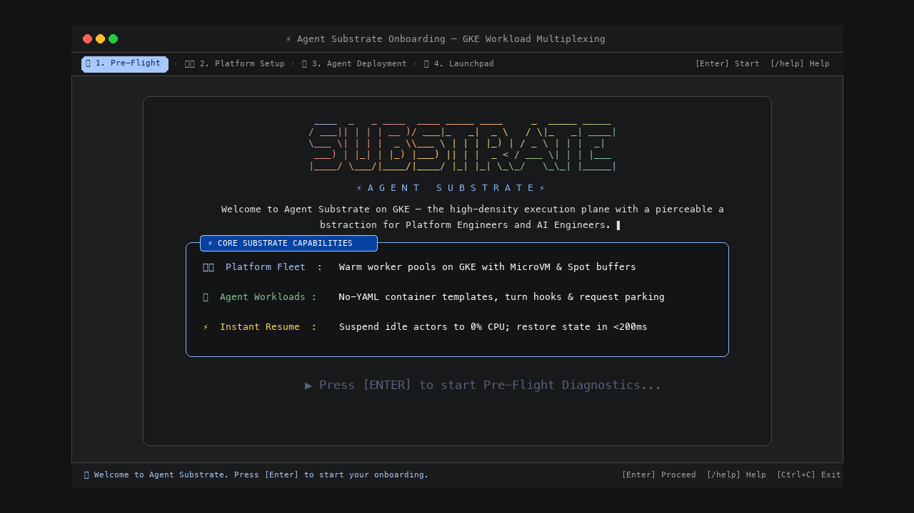
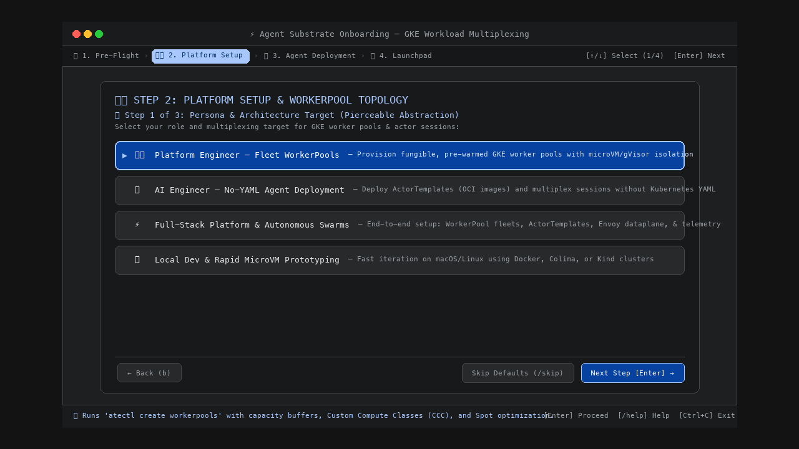
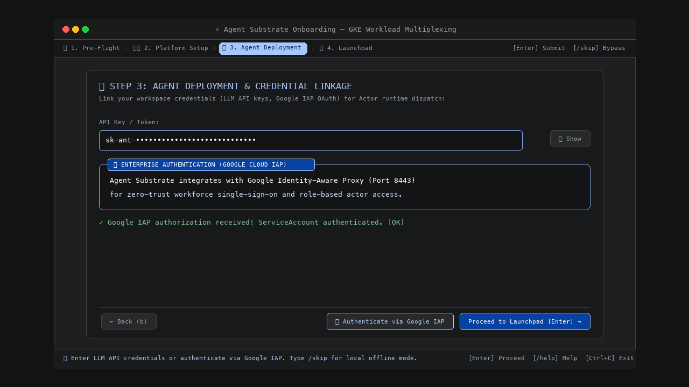
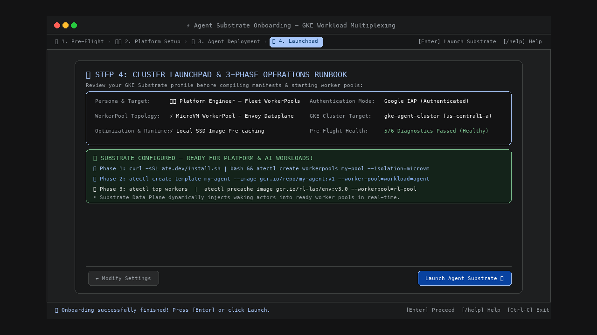
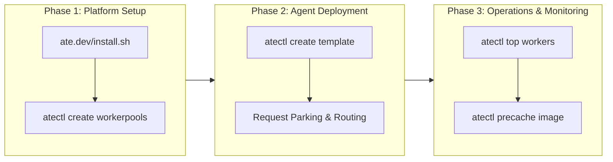
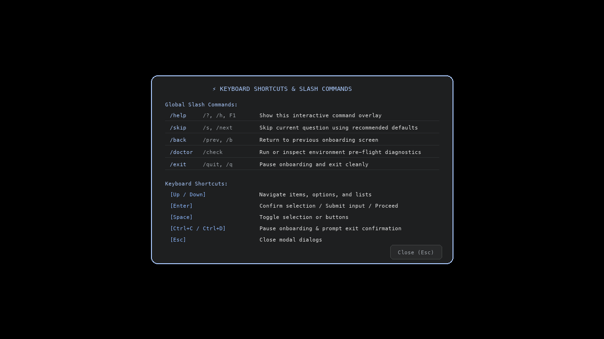

# ⚡ Agent Substrate: Onboarding Guide & UX Specifications

> **Audience**: Platform Engineers, AI Application Developers, and SRE / Operations Teams  
> **Supported Environments**: Google Kubernetes Engine (GKE) & Local Workstations  
> **Available Interfaces**: Interactive Web Simulator (`./open_simulator.sh`), Terminal Application (`python3 onboard.py`), and CLI (`atectl`)

---

## 🧭 Section 1: Critical User Journeys (CUJs)

Agent Substrate provides a **"pierceable abstraction"**—a system that gives AI developers a simple, cloud-native experience while giving infrastructure teams deep control over security, cost, and machine performance.

Below are the primary user journeys supported by the onboarding experience, explained in plain language.

```
┌─────────────────────────────────────────────────────────────────────────────────────────────┐
│                                 CRITICAL USER JOURNEYS (CUJs)                               │
├──────────────────────────────┬──────────────────────────────┬───────────────────────────────┤
│ 🛠️ CUJ 1: Platform Engineer  │ 🤖 CUJ 2: AI Developer       │ 🧪 CUJ 3: Local Developer     │
│ Shared Fleet & Cost Control  │ Fast No-YAML Agent Launch    │ Laptop Testing & Diagnostics  │
└──────────────────────────────┴──────────────────────────────┴───────────────────────────────┘
```

---

### 🛠️ CUJ 1: Platform Engineer — Setting Up the Shared Machine Fleet

**User Goal**: Create a shared fleet of warm, ready worker computers on Google Cloud so AI teams can launch agents immediately without wasting cloud budget on idle machines.

- **The Challenge**: Traditional cloud setups take minutes to start a new computer for an AI agent. Keeping hundreds of computers running 24/7 is too expensive, but turning them off creates slow "cold starts" for users.
- **How Onboarding Helps**:
  1. Guides the engineer through selecting a **Worker Pool** size (e.g., 50 standby pods).
  2. Enables **Hardware-Isolated Sandboxes** (MicroVMs) so untrusted agent code cannot access the host machine.
  3. Turns on **Fast Image Caching** on local SSDs so multi-gigabyte AI models load instantly.
- **Outcome**: A secure, cost-efficient compute fleet running on GKE that automatically sleeps idle agents to 0% CPU and wakes them in under 200 milliseconds.

---

### 🤖 CUJ 2: AI Application Developer — Deploying an Agent (No Cloud YAML Needed)

**User Goal**: Take an agent program (packaged in a standard container image) and deploy it to users without writing complex Kubernetes configuration files.

- **The Challenge**: AI developers want to build logic with LLMs (like Gemini, Claude, or OpenAI), not spend hours debugging 200-line Kubernetes YAML files, networking rules, and ingress routes.
- **How Onboarding Helps**:
  1. Lets the developer register their container image directly (`atectl create template`).
  2. Connects model API keys or enterprise single-sign-on (**Google Identity-Aware Proxy**) with masked password fields.
  3. Provides built-in **Request Parking** so incoming user messages wait safely in queue while sleeping agents wake up.
- **Outcome**: The agent is live in seconds. When waiting for a human reply, it automatically frees up machine memory; when the human speaks, it resumes right where it left off.

---

### 🧪 CUJ 3: Local Developer & Tester — Laptop Sandbox Prototyping

**User Goal**: Quickly test agent workflows and verify setup locally on a laptop (macOS or Linux) before deploying to production.

- **The Challenge**: Setting up local dependencies (Docker, Colima, Python runtimes, CLIs) often fails with cryptic error messages.
- **How Onboarding Helps**:
  1. Runs an automated **Pre-Flight Doctor** that tests all prerequisites in seconds.
  2. When a tool is missing or stopped (e.g., Docker is not running), it displays an **Action Required card** with a 1-click **`[⚡ Fix Inline]`** button and a direct documentation link.
  3. Allows typing **`/skip`** or clicking **`[Skip for Local Testing]`** to bypass production credentials during local testing.
- **Outcome**: A fully verified local development environment ready for testing within 60 seconds.

---

### 📊 CUJ 4: SRE & Operations Lead — Health Monitoring & Day-2 Management

**User Goal**: Inspect cluster health, monitor worker computer utilization, and prevent system bottlenecks.

- **How Onboarding Helps**:
  1. Delivers a clean **3-Phase Operations Runbook** at the end of setup with exact CLI commands for everyday maintenance.
  2. Provides commands to inspect active workers (`atectl top workers`) and pre-warm images on node disks (`atectl precache image`).
- **Outcome**: Full visibility into cluster performance and predictable operating costs.

---

## 🎨 Section 2: UX Specifications & Screen Walkthrough

The onboarding interface follows **Google Material 3 design principles**, using clear visual hierarchy, accessible color contrast, and keyboard navigation.

```
╭────────────────────────────────────────────────────────────────────────────────────────────────────────╮
│ ⚡ Google Cloud │ Agent Substrate    [ 🩺 1. Pre-Flight ] › 🛠️ 2. Platform Setup › 🤖 3. Agent Deployment  │
╰────────────────────────────────────────────────────────────────────────────────────────────────────────╯
```

---

### 🚀 Step 0: Welcome Splash & Identity

The entry screen welcomes the user with Google branding, an animated logo, and a clear matrix of core capabilities.



#### Core Capabilities Matrix

```
╭── ⚡ CORE SUBSTRATE CAPABILITIES ────────────────────────────────────────────────╮
│                                                                                  │
│  🛠️  Platform Fleet  : Warm worker pools on GKE with MicroVM & Spot buffers      │
│                                                                                  │
│  🤖  Agent Workloads : No-YAML container templates, turn hooks & request parking │
│                                                                                  │
│  ⚡  Instant Resume  : Suspend idle actors to 0% CPU; restore state in <200ms    │
│                                                                                  │
╰──────────────────────────────────────────────────────────────────────────────────╯
```

- **High-Contrast Title**: Highlighted in **`bold #ffffff on #0842a0`** with a bright Google Blue border (**`#8ab4f8`**).
- **Generous Spacing**: Vertical spacing between capability rows provides clear breathing room.
- **Instant Start**: Press **`[Enter]`** at any time to skip typewriter animations and start pre-flight checks.

---

### 🩺 Step 1: Pre-Flight Diagnostics & Actionable Remedies

Step 1 automatically checks your workstation and connected Google Cloud environment to ensure everything is ready before you configure your cluster.


#### Diagnostic Health Probes (Plain Language)

| Health Check | Plain-Language Meaning | Why It Matters | Documentation |
| :--- | :--- | :--- | :--- |
| **Version Control (Git)** | Git identity & workspace tracking | Attaches your name and commit history to agent templates. | [Git Guide](https://git-scm.com/doc) |
| **Python Environment** | Python runtime (version 3.10+) | Runs developer scripts and local agent testing tools. | [Python Docs](https://docs.python.org/3/) |
| **Agent Sandbox Engine** | Docker / Podman / Colima | Runs agent code inside lightweight, secure sandboxes so it cannot harm your computer. | [Sandbox Guide](https://ate.dev/docs/sandboxes) |
| **Connected Cloud Cluster** | GKE / Kubectl Cluster Context | Links your terminal to your Google Cloud cluster where worker computers live. | [GKE Cluster Access](https://cloud.google.com/kubernetes-engine/docs) |
| **Substrate Helper Tools** | `atectl` Command-Line Tool | Manages worker pools and agent rollouts with simple commands (No Kubernetes YAML). | [atectl CLI Docs](https://ate.dev/docs/cli) |
| **Cloud Connection & Memory** | Google Cloud Storage (GCS) | When agents are idle, memory is saved to cloud storage so they resume in milliseconds. | [Architecture Guide](https://ate.dev/docs/architecture) |

#### 💡 The Actionable Remedy Component

When a prerequisite requires attention (e.g., Docker Engine is stopped), the interface displays a structured **Action Required** card:

```
  ┌─ 💡 Action Required ───────────────────────────────────────────────────────────
  │  ℹ️  Agent Substrate runs agents inside lightweight, secure sandboxes so code cannot harm your computer.
  │  📋 Command: open -a Docker || colima start
  │  📖 Docs:    https://ate.dev/docs/sandboxes
  └─────────────────────────────────────────────────────────────────────────────────
```

- **📋 One-Click Copy**: Click **`[📋 Copy]`** in the Web Simulator or press **`c`** in the terminal to copy the fix command to your clipboard.
- **⚡ Run Inline**: Click **`[⚡ Fix Inline]`** to run the resolution in the background. The check updates live to **`✓ [OK]`**.
- **📖 Official Documentation**: Click **`[📖 Docs ↗]`** to open the relevant setup guide in your browser.
- **Non-Blocking**: Diagnostics never freeze the wizard—press **`[Enter]`** to continue whenever you are ready.

---

### 🛠️ Step 2: Platform Setup & Worker Pool Topology

Step 2 is tailored for **Platform Engineers** configuring compute pools and isolation settings on GKE.



#### 3-Substep Configuration

1. **Workload Architecture & Role**:
   - 🛠️ **Platform Engineer — Fleet WorkerPools** *(Recommended)*: Pre-warmed worker pools on GKE with Spot capacity buffers.
   - 🤖 **AI Developer — Serverless ActorTemplates**: Deploy agent templates directly without managing compute pools.
   - 🧪 **Local Standalone Evaluation**: Lightweight single-node local sandbox.
2. **Traffic Router & State Storage**:
   - ⚡ **Envoy Router + Valkey/Redis Cache** *(Recommended)*: Sub-millisecond suspend/resume request routing with Request Parking.
   - 🪣 **Google Cloud Storage (GCS) Snapshots**: Deep memory persistence for agents sleeping longer than 10 minutes.
3. **Isolation & Speed Optimization**:
   - ⚡ **Local SSD Image Pre-caching** *(Recommended)*: Pre-downloads agent container images onto node disks to eliminate startup delays.
   - 🛡️ **Hardware MicroVMs (`--isolation=microvm`)**: Hardware-virtualized security boundaries for untrusted code.
   - 🔒 **gVisor Sandboxes (`--isolation=gvisor`)**: Lightweight user-space kernel sandboxing.

---

### 🤖 Step 3: Agent Deployment & Enterprise Login

Step 3 is tailored for **AI Developers** registering agent container images and enterprise authentication.



#### Credentials & Login Options

```
╭── 🌐 ENTERPRISE AUTHENTICATION (GOOGLE CLOUD IAP) ───────────────────────────────╮
│                                                                                  │
│  Agent Substrate integrates with Google Identity-Aware Proxy (Port 8443)         │
│  for zero-trust workforce single-sign-on and role-based actor access.            │
│                                                                                  │
╰──────────────────────────────────────────────────────────────────────────────────╯
```

- **Model API Keys**: Securely enter keys for Gemini, Anthropic, or OpenAI with automatic password masking (`sb-l********5d3`) and an `[👁 Show] / [🔒 Hide]` toggle.
- **Enterprise Google IAP Single-Sign-On**: Click **`[🌐 Authenticate via Google IAP]`** for zero-trust enterprise single-sign-on with Google Identity-Aware Proxy.
- **Local Dev Bypass**: Click **`[Skip for Local Testing]`** or type **`/skip`** to test offline without cloud credentials.

---

### 🛸 Step 4: Cluster Launchpad & Operations Runbook

Step 4 compiles all selected options into cluster resources, tests cold-start and resume latency, and delivers your everyday **Operations Runbook**.



#### The 3-Phase Operational Lifecycle



```bash
# Phase 1: Platform Setup (Platform Engineers)
curl -sSL ate.dev/install.sh | bash
atectl create workerpools default-pool --isolation=microvm --min-ready=5

# Phase 2: Agent Deployment (AI Developers - No YAML Needed)
atectl create template code-reviewer \
  --image=gcr.io/my-org/code-agent:v1.0 \
  --worker-pool=workload=agent

# Phase 3: Monitoring & Fleet Optimization (SRE / Ops)
atectl top workers
atectl precache image gcr.io/rl-lab/env:v3.0 --workerpool=default-pool
```

---

### ⚡ Global Slash Commands & Keyboard Shortcuts

Pressing **`F1`** or typing **`/help`** brings up the interactive command overlay:



| Command | Aliases | What It Does (Plain Language) |
| :--- | :--- | :--- |
| **`/help`** | `/?`, `/h`, `F1` | Opens the full help overlay and keyboard shortcut legend. |
| **`/doctor`** | `/check`, `/diag` | Jumps straight to the Pre-Flight Diagnostics screen. |
| **`/skip`** | `/s`, `/next` | Skips the current question using recommended defaults. |
| **`/back`** | `/prev`, `/b` | Returns to the previous screen while saving your choices. |
| **`/exit`** | `/quit`, `/q` | Opens the safe exit prompt to preserve session state. |

---

## 📺 Section 3: Demo Assets & Verification

| Asset | Location / Command | Description |
| :--- | :--- | :--- |
| **🌐 Interactive Web Simulator** | `./open_simulator.sh` *(or `open demos/onboarding-tui/index.html`)* | Hands-on clickable browser prototype with Autopilot mode, tab navigation, and live remedy buttons. |
| **🎬 HD Video Demo (1080p MP4)** | `open demos/onboarding-tui/onboarding_demo.mp4` | High-definition screen recording walking through all CUJs and features. |
| **💻 Native Terminal Application** | `cd /Users/rajithal/substrate && python3 onboard.py` | Full-fidelity interactive terminal onboarding application. |
| **🖼️ High-Res Step Screenshots** | `demos/onboarding-tui/screenshots/` | High-resolution PNG step snapshots for presentations, documentation, and slides. |
