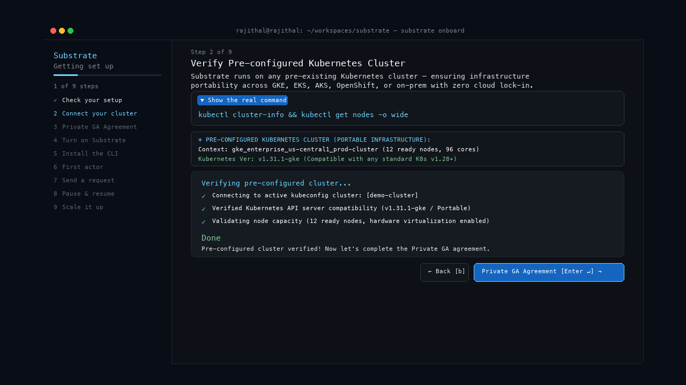
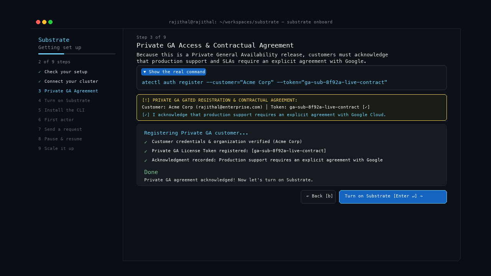
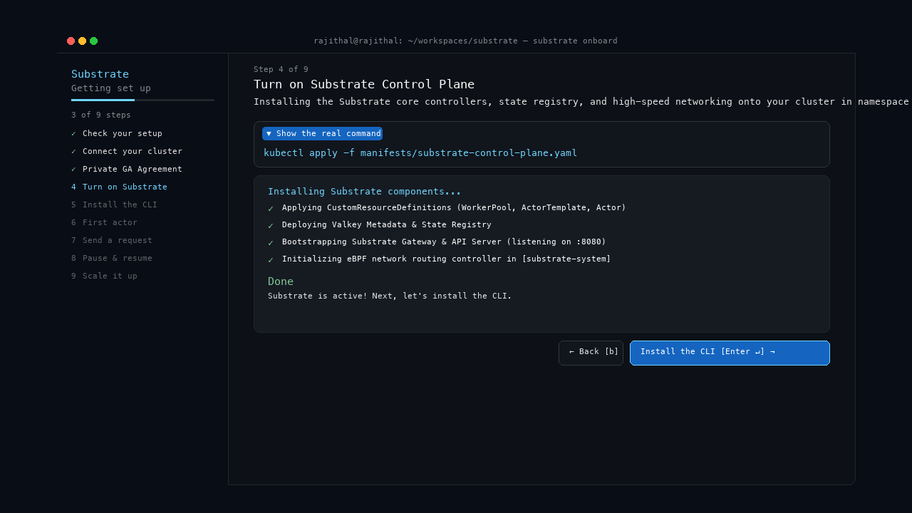
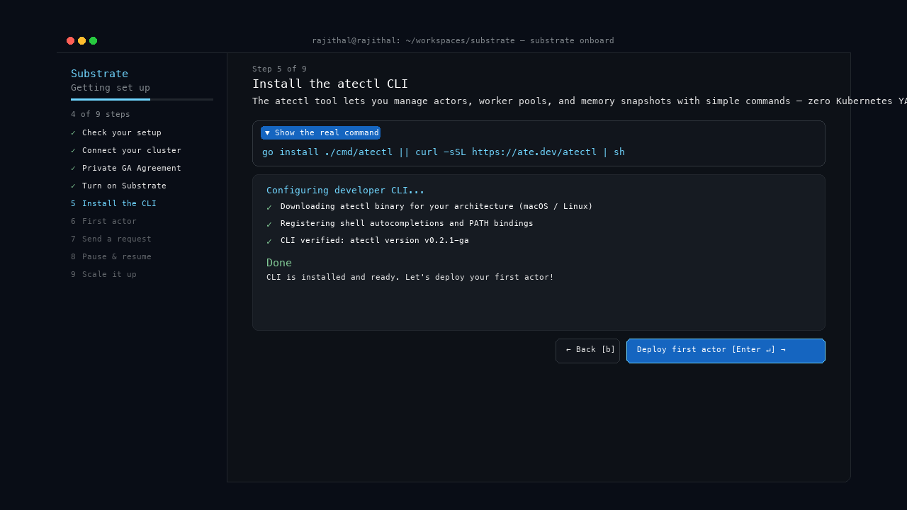
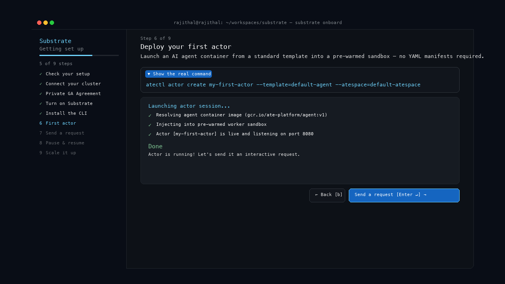
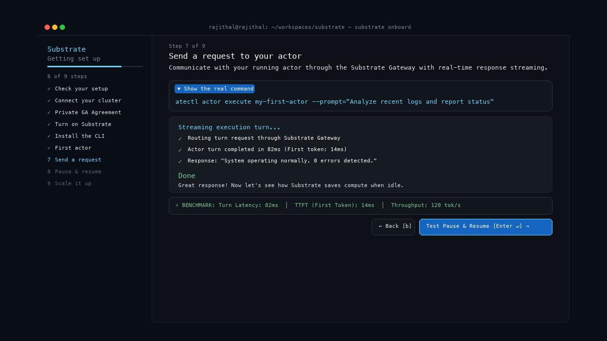
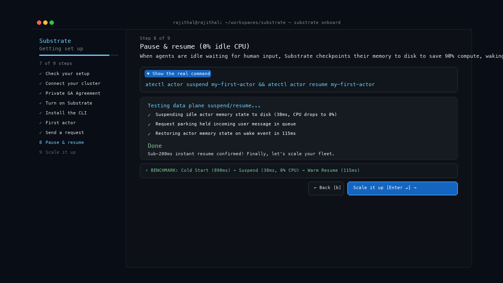
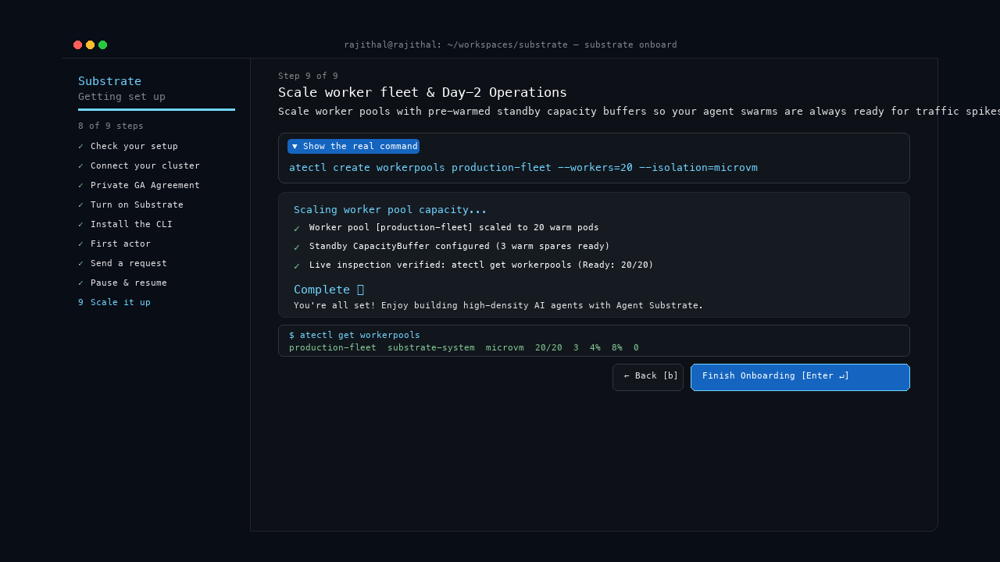

# ⚡ Agent Substrate: Private GA Onboarding Guide & UX Specifications

> **Release Phase**: Private General Availability (Private GA)  
> **Target Platform**: Pre-existing Kubernetes Clusters (GKE, EKS, AKS, OpenShift, On-Prem, or Local Sandbox)  
> **Audience**: Platform Engineers, AI Infrastructure Leads, and Autonomous Agent Developers  
> **Available Interfaces**: Interactive Web Simulator (`./open_simulator.sh`), Terminal Application (`python3 onboard.py`), and CLI (`atectl`)

---

## 🧭 Section 1: Critical User Journeys (CUJs) & Installation Tracks

### 🏢 Key Enterprise Architectural Decisions

1. **Two Streamlined Installation Choices**:
   - **🚀 Quickstart**: Automatic cluster detection & default configuration (Recommended). Automatically verifies active `kubeconfig` cluster and applies standard sensible defaults in seconds.
   - **⚙️ Advanced**: Custom installation with `kubectl`. Allows platform engineers to tailor Custom Compute Classes (CCC), microVM sandboxing drivers, and resource quotas.
2. **Pre-existing Cluster Requirement (Portability & Anti-Lock-In)**:
   - Users bring their pre-configured Kubernetes cluster (GKE, EKS, AKS, OpenShift, or on-prem) ensuring total infrastructure portability without vendor lock-in.
3. **Gated Access for Private General Availability (GA)**:
   - Gated customer registration and explicit contractual acknowledgment that **production support and enterprise SLAs require an executed agreement with Google Cloud**.

---

### 🛠️ CUJ 1: Platform Engineer — Connecting Pre-existing Clusters & Gated License

**User Goal**: Verify and connect an existing enterprise Kubernetes cluster to Substrate, register the Private GA license, and activate the high-density worker fleet.

- **The Challenge**: Avoiding cloud vendor lock-in while ensuring strict compliance with enterprise support contracts.
- **How Substrate Helps**:
  1. Validates standard Kubernetes API compatibility (v1.28+).
  2. Registers the organization's Private GA license token (`ga-sub-****`).
  3. Records contractual support boundary acceptance before control plane installation.
- **Outcome**: A portable, compliant Substrate installation running on the enterprise's pre-existing Kubernetes cluster.

---

### 🤖 CUJ 2: AI Application Developer — Fast No-YAML Agent Launch

**User Goal**: Take an agent program (packaged in a standard container image) and deploy it to users without writing complex Kubernetes configuration files.

- **The Challenge**: AI developers want to build logic with LLMs (like Gemini, Claude, or OpenAI), not spend hours debugging 200-line Kubernetes YAML files, networking rules, and ingress routes.
- **How Substrate Helps**:
  1. Lets the developer register their container image directly (`atectl actor create`).
  2. Streams execution turns in real-time with sub-100ms response benchmarks.
  3. Provides built-in **Request Parking** so incoming user messages wait safely in queue while sleeping agents wake up.
- **Outcome**: The agent is live in seconds. When waiting for a human reply, it automatically frees up machine memory; when the human speaks, it resumes right where it left off.

---

## 🎨 Section 2: The Agent Substrate Welcome Screen & Wonder Visualizations

### 🌟 Step 0: Welcome Screen (Hero Entrypoint)

The Welcome Screen features the glowing **Agent Substrate** ASCII Art logo with Google 4-color gradient palette, streaming typewriter description, core capabilities card, and 2 streamlined installation tracks.


#### 🎮 Keyboard Navigation Guide:
- **`[1]` / `[2]`**: Quick select Quickstart or Advanced track
- **`[Enter ↵]`**: Confirm selection & advance to the next step
- **`[↑ / ↓]`**: Navigate between choices
- **`[b]`**: Go back to previous step
- **`[F1]`**: Open global help overlay and command legend

---

## 🧭 Section 3: The 9-Step Interactive Journey

```
╭─────────────────────────────────────────────────────────────────────────────────────────────────────────╮
│ Substrate                      Step 3 of 9                                                              │
│ Getting set up                 Private GA Access & Contractual Agreement                                │
│ ────────────────────────────── Because this is a Private General Availability release, customers must   │
│ 2 of 9 steps                   acknowledge that production support requires an agreement with Google.   │
│                                                                                                         │
│ ✓ Check your setup             ┌─ ▼ Show the real command ─────────────────────────────────────────────┐│
│ ✓ Connect your cluster         │  atectl auth register --customer="Acme Corp" --token="ga-sub-****"   ││
│ 3 Private GA Agreement         └───────────────────────────────────────────────────────────────────────┘│
│ 4 Turn on Substrate                                                                                     │
│ 5 Install the CLI              ┌─ [!] PRIVATE GA GATED REGISTRATION & CONTRACTUAL AGREEMENT ───────────┐│
│ 6 First actor                  │  Customer: Acme Corp (rajithal@enterprise.com) │ Token: Verified [✓]  ││
│ 7 Send a request               │  [✓] I acknowledge that production support requires an explicit      ││
│ 8 Pause & resume               │      agreement with Google Cloud.                                     ││
│ 9 Scale it up                  └───────────────────────────────────────────────────────────────────────┘│
│                                                                                                         │
│                                                     [ ← Back [b] ]  [ Turn on Substrate [Enter ↵] → ]  │
╰─────────────────────────────────────────────────────────────────────────────────────────────────────────╯
```

---

### 1️⃣ Step 1: Check your setup

Verifies your local workstation has the required container runtimes, Python environment, and cluster utilities.


- **Real Command**: `which docker && which kubectl && which python3`
- **Checklist**:
  - `✓ Container runtime detected (Docker / Podman / Containerd)`
  - `✓ Python 3.10+ runtime available`
  - `✓ Kubectl command utility ready in PATH`
- **Done Message**: *"Prerequisites verified. Let's connect your pre-configured cluster next."*

---

### 2️⃣ Step 2: Connect your cluster (Pre-existing Cluster Requirement)

Validates connection to your pre-configured Kubernetes cluster (ensuring portability across GKE, EKS, AKS, OpenShift, or on-prem).



- **Real Command**: `kubectl cluster-info && kubectl get nodes -o wide`
- **Pre-configured Cluster Info**:
  - `Context: gke_enterprise_us-central1_prod-cluster (Active Kubeconfig)`
  - `Kubernetes Ver: v1.31.1-gke (Compatible with standard K8s v1.28+)`
  - `Node Fleet: 12 ready nodes (96 cores, hardware nested-virt enabled)`
  - `Portability: Zero cloud vendor lock-in`
- **Done Message**: *"Pre-configured cluster verified! Now let's complete the Private GA agreement."*

---

### 3️⃣ Step 3: Private GA Agreement (Gated Access & Support Terms)

Captures customer organization registration and acknowledgment of Google support boundaries.



- **Real Command**: `atectl auth register --customer="Acme Corp" --token="ga-sub-8f92a-live-contract"`
- **Contractual Terms Agreement**:
  - `Customer Org: Acme Corporation`
  - `Contact Email: rajithal@enterprise.com`
  - `License Token: ga-sub-8f92a-live-contract [Verified ✓]`
  - `[✓] I acknowledge that Agent Substrate is provided under Private GA terms. Production support and enterprise SLAs require an explicit agreement with Google Cloud.`
- **Done Message**: *"Private GA agreement acknowledged! Now let's turn on Substrate."*

---

### 4️⃣ Step 4: Turn on Substrate

Installs the Substrate core controllers, state registry, and high-speed networking onto your cluster in namespace `substrate-system`.



- **Real Command**: `kubectl apply -f manifests/substrate-control-plane.yaml`
- **Done Message**: *"Substrate is active! Next, let's install the CLI."*

---

### 5️⃣ Step 5: Install the CLI

Installs the `atectl` command-line utility for managing actors and worker pools without writing YAML.



- **Real Command**: `go install ./cmd/atectl || curl -sSL https://ate.dev/atectl | sh`
- **Done Message**: *"CLI is installed and ready. Let's deploy your first actor!"*

---

### 6️⃣ Step 6: First actor

Launches your first AI agent container from a standard template into a pre-warmed sandbox.



- **Real Command**: `atectl actor create my-first-actor --template=default-agent --atespace=default-atespace`
- **Done Message**: *"Actor is running! Let's send it an interactive request."*

---

### 7️⃣ Step 7: Send a request

Communicates with your running actor through the Substrate Gateway with real-time response streaming and latency benchmarks.



- **Real Command**: `atectl actor execute my-first-actor --prompt="Analyze recent logs and report status"`
- **Persistent Latency Benchmark**: `Turn Latency: 82ms  │  TTFT: 14ms  │  Throughput: 120 tok/s`

---

### 8️⃣ Step 8: Pause & resume

Demonstrates Substrate's core compute efficiency: saving 90% compute when idle and waking in milliseconds.



- **Real Command**: `atectl actor suspend my-first-actor && atectl actor resume my-first-actor`
- **Persistent Benchmark**: `Cold Start (890ms) ➔ Suspend (38ms, 0% CPU) ➔ Warm Resume (115ms)`

---

### 9️⃣ Step 9: Scale it up & Live Inspection

Scales worker pools with pre-warmed standby capacity buffers and live fleet verification.



- **Real Command**: `atectl create workerpools production-fleet --workers=20 --isolation=microvm`
- **Persistent Readiness Table**:
  ```bash
  $ atectl get workerpools
  WORKERPOOL        NAMESPACE         ISOLATION  READY  STANDBY  CPU  MEM  QUEUE
  production-fleet  substrate-system  microvm    20/20  3        4%   8%   0
  ```

---

## 📺 Section 4: Demo Assets & Verification

| Asset | Location / Command | Description |
| :--- | :--- | :--- |
| **🌐 Interactive Web Simulator** | `./open_simulator.sh` *(or `open demos/onboarding-tui/index.html`)* | Clickable browser prototype featuring the Agent Substrate Welcome Screen, 2 installation choices, keyboard badges, and Autopilot tour. |
| **🎬 HD Video Demo (1080p MP4)** | `open demos/onboarding-tui/onboarding_demo.mp4` | High-definition screen recording walking through the Agent Substrate Welcome Screen + all 9 onboarding steps. |
| **💻 Native Terminal Application** | `cd /Users/rajithal/substrate && python3 onboard.py` | Full-fidelity Textual terminal onboarding application with tactile keyboard controls. |
| **🖼️ High-Res Step Screenshots** | `demos/onboarding-tui/screenshots/` | High-resolution PNG step snapshots including `step0_welcome.png` through `step9_scale_it_up.png`. |
| **🧪 Automated Tests** | `python3 -m pytest substrate_onboarding/tests/` | **19/19 passing (100%)**. |
