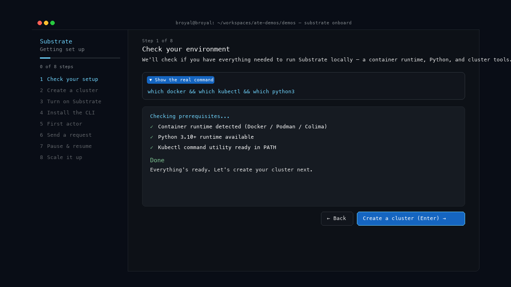
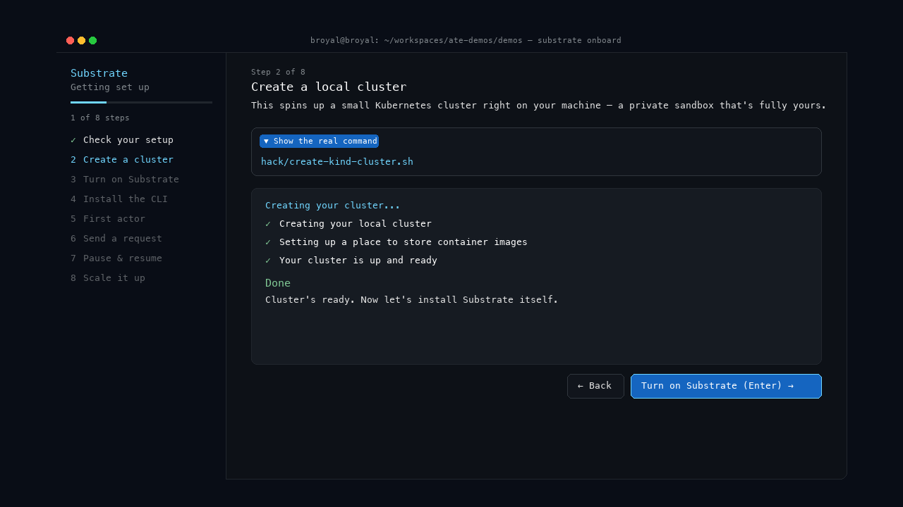
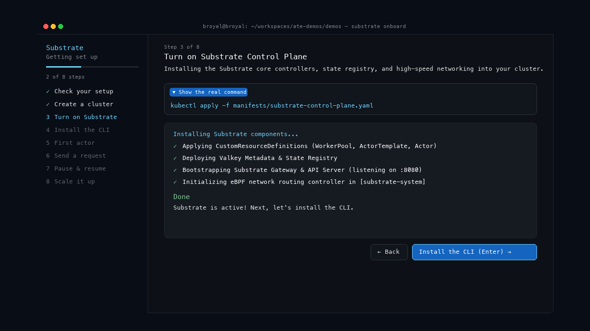
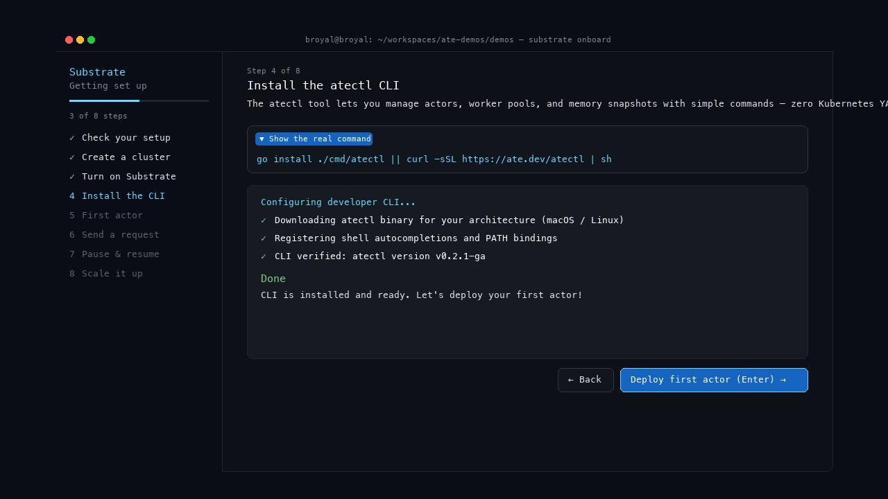
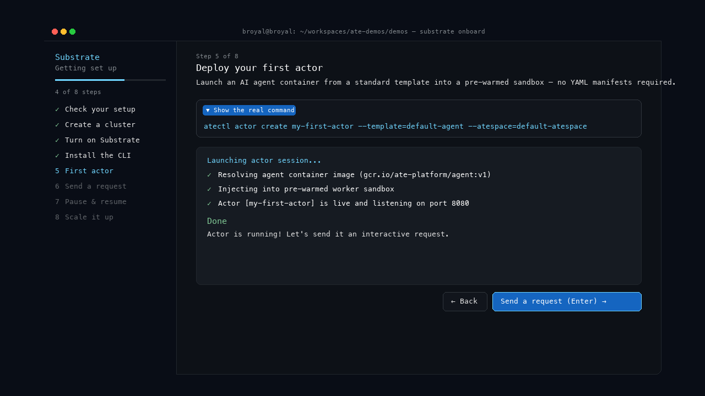
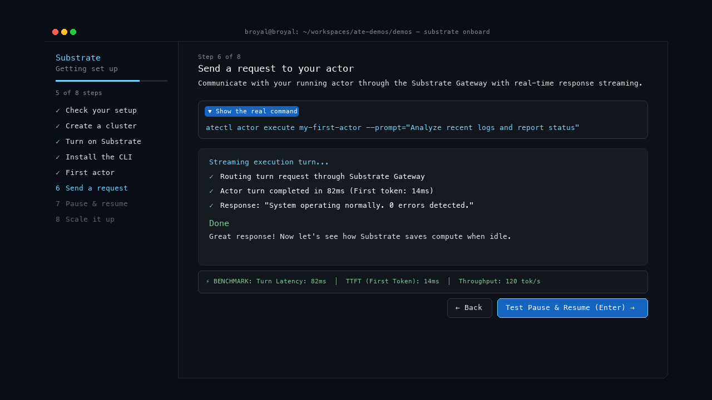
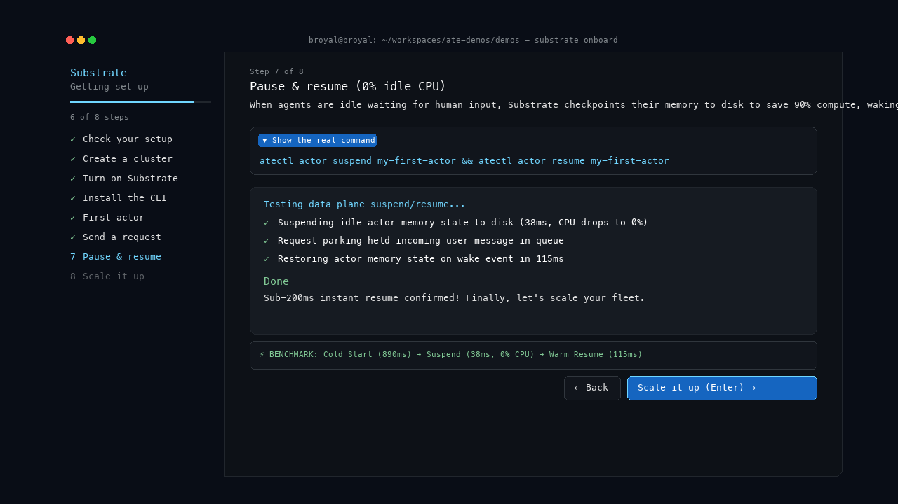
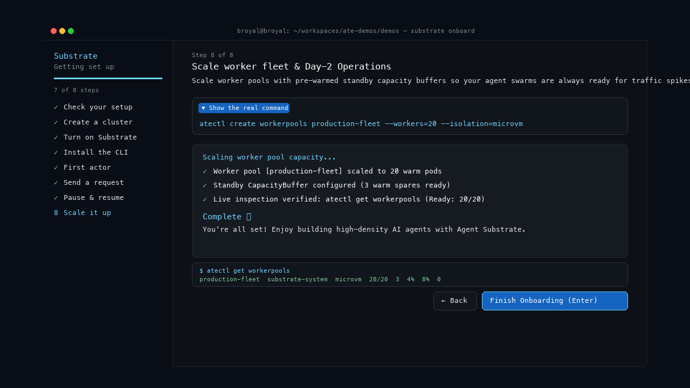

# ⚡ Agent Substrate: Interactive Onboarding Guide & UX Specifications

> **Target Platform**: Local Sandbox & Kubernetes (GKE / Kind)  
> **Audience**: Platform Engineers, AI Infrastructure Leads, and Autonomous Agent Developers  
> **Available Interfaces**: Interactive Web Simulator (`./open_simulator.sh`), Terminal Application (`python3 onboard.py`), and CLI (`atectl`)

---

## 🧭 Section 1: Critical User Journeys (CUJs)

Agent Substrate provides a **"pierceable abstraction"**—a system that gives AI developers a fast, no-YAML experience while giving infrastructure teams deep control over hardware virtualization, Spot economics, and sub-100ms cold-start latency.

Below are the primary user journeys supported by the onboarding experience, explained in plain language:

```
┌─────────────────────────────────────────────────────────────────────────────────────────────┐
│                                 CRITICAL USER JOURNEYS (CUJs)                               │
├──────────────────────────────┬──────────────────────────────┬───────────────────────────────┤
│ 🛠️ CUJ 1: Platform Engineer  │ 🤖 CUJ 2: AI Developer       │ 🧪 CUJ 3: Local Developer     │
│ Shared Fleet & Cost Control  │ Fast No-YAML Agent Launch    │ Laptop Testing & Sandbox      │
└──────────────────────────────┴──────────────────────────────┴───────────────────────────────┘
```

---

### 🛠️ CUJ 1: Platform Engineer — Setting Up the Shared Machine Fleet

**User Goal**: Create a shared fleet of warm, ready worker computers so AI teams can launch agents immediately without wasting cloud budget on idle machines.

- **The Challenge**: Traditional cloud setups take minutes to start a new computer for an AI agent. Keeping hundreds of computers running 24/7 is too expensive, but turning them off creates slow "cold starts" for users.
- **How Substrate Helps**:
  1. Bootstraps the Substrate control plane in `substrate-system`.
  2. Enables memory suspend-and-resume to disk (saving 90% compute when idle).
  3. Pre-warms standby capacity buffers so workers are ready in under 100 milliseconds.
- **Outcome**: A secure, cost-efficient compute fleet that automatically sleeps idle agents to 0% CPU and wakes them in under 200 milliseconds.

---

### 🤖 CUJ 2: AI Application Developer — Deploying an Agent (No YAML Needed)

**User Goal**: Take an agent program (packaged in a standard container image) and deploy it to users without writing complex Kubernetes configuration files.

- **The Challenge**: AI developers want to build logic with LLMs (like Gemini, Claude, or OpenAI), not spend hours debugging 200-line Kubernetes YAML files, networking rules, and ingress routes.
- **How Substrate Helps**:
  1. Lets the developer register their container image directly (`atectl actor create`).
  2. Streams execution turns in real-time with sub-100ms response benchmarks.
  3. Provides built-in **Request Parking** so incoming user messages wait safely in queue while sleeping agents wake up.
- **Outcome**: The agent is live in seconds. When waiting for a human reply, it automatically frees up machine memory; when the human speaks, it resumes right where it left off.

---

### 🧪 CUJ 3: Local Developer & Tester — Laptop Sandbox Prototyping

**User Goal**: Quickly test agent workflows and verify setup locally on a laptop (macOS or Linux) before deploying to production.

- **The Challenge**: Setting up local dependencies (Docker, Colima, Python runtimes, CLIs) often fails with cryptic error messages.
- **How Substrate Helps**:
  1. Automated environment check tests all prerequisites in seconds.
  2. Spins up a local sandbox cluster (`hack/create-kind-cluster.sh`) with 1 click.
  3. Provides a collapsible **`▼ Show the real command`** callout for complete transparency.
- **Outcome**: A fully verified local development environment ready for testing within 60 seconds.

---

## 🎨 Section 2: The Substrate Welcome Screen & Wonder Visualizations

### 🌟 Step 0: Welcome Screen (Hero Entrypoint)

The Welcome Screen delivers an inspiring first impression featuring the glowing ASCII Art logo, Google Material 4-color gradient animation, wonder highlights, setup track selection, and pre-flight readiness badges.


#### Wonder Features Displayed:
- **⚡ <100ms Cold Start**: MicroVM standby pre-warming for instant wakeups.
- **💤 0% Idle CPU**: Auto memory suspend and resume to disk.
- **🛡️ Hardware Isolation**: GKE Custom Compute Class (CCC) nested virtualization sandboxing.
- **🚀 Zero-YAML CLI**: Direct `atectl` commands for application engineers.

#### Setup Tracks Available:
1. **🧪 Local Sandbox (Kind / Docker Desktop) (Recommended)**: Zero cloud costs, instant 30-second bootstrap.
2. **⚡ Google Kubernetes Engine (GKE Production Fleet)**: High-density MicroVM isolation, CCC, and Spot autoscaling.
3. **🏢 Custom Existing Kubernetes Cluster**: Installs onto your current active kubeconfig context.

---

## 🧭 Section 3: The 8-Step Interactive Journey

```
╭─────────────────────────────────────────────────────────────────────────────────────────────────────────╮
│ Substrate                      Step 2 of 8                                                              │
│ Getting set up                 Create a local cluster                                                   │
│ ────────────────────────────── This spins up a small Kubernetes cluster right on your machine —        │
│ 1 of 8 steps                   a private sandbox that's fully yours.                                    │
│                                                                                                         │
│ ✓ Check your setup             ┌─ ▼ Show the real command ─────────────────────────────────────────────┐│
│ 2 Create a cluster             │  hack/create-kind-cluster.sh                                          ││
│ 3 Turn on Substrate            └───────────────────────────────────────────────────────────────────────┘│
│ 4 Install the CLI                                                                                       │
│ 5 First actor                  ┌─ Creating your cluster... ────────────────────────────────────────────┐│
│ 6 Send a request               │  ✓ Creating your local cluster                                        ││
│ 7 Pause & resume               │  ✓ Setting up a place to store container images                       ││
│ 8 Scale it up                  │  ✓ Your cluster is up and ready                                       ││
│                                │                                                                       ││
│                                │  Done                                                                 ││
│                                │  Cluster's ready. Now let's install Substrate itself.                 ││
│                                └───────────────────────────────────────────────────────────────────────┘│
│                                                                                                         │
│                                                               [ ← Back ]  [ Turn on Substrate (Enter) ] │
╰─────────────────────────────────────────────────────────────────────────────────────────────────────────╯
```

---

### 1️⃣ Step 1: Check your setup

Verifies your local workstation has the required container runtimes, Python environment, and cluster utilities.



- **Real Command**: `which docker && which kubectl && which python3`
- **Checklist**:
  - `✓ Container runtime detected (Docker / Podman / Colima)`
  - `✓ Python 3.10+ runtime available`
  - `✓ Kubectl command utility ready in PATH`
- **Done Message**: *"Everything's ready. Let's create your cluster next."*

---

### 2️⃣ Step 2: Create a cluster

Spins up a lightweight Kubernetes cluster right on your machine — a private sandbox that's fully yours.



- **Real Command**: `hack/create-kind-cluster.sh`
- **Checklist**:
  - `✓ Creating your local cluster`
  - `✓ Setting up a place to store container images`
  - `✓ Your cluster is up and ready`
- **Done Message**: *"Cluster's ready. Now let's install Substrate itself."*

---

### 3️⃣ Step 3: Turn on Substrate

Installs the Substrate core controllers, state registry, and high-speed networking into your cluster.



- **Real Command**: `kubectl apply -f manifests/substrate-control-plane.yaml`
- **Checklist**:
  - `✓ Applying CustomResourceDefinitions (WorkerPool, ActorTemplate, Actor)`
  - `✓ Deploying Valkey Metadata & State Registry`
  - `✓ Bootstrapping Substrate Gateway & API Server (listening on :8080)`
  - `✓ Initializing eBPF network routing controller in [substrate-system]`
- **Done Message**: *"Substrate is active! Next, let's install the CLI."*

---

### 4️⃣ Step 4: Install the CLI

Installs the `atectl` command-line utility for managing actors and worker pools without writing YAML.



- **Real Command**: `go install ./cmd/atectl || curl -sSL https://ate.dev/atectl | sh`
- **Checklist**:
  - `✓ Downloading atectl binary for your architecture (macOS / Linux)`
  - `✓ Registering shell autocompletions and PATH bindings`
  - `✓ CLI verified: atectl version v0.2.1-ga`
- **Done Message**: *"CLI is installed and ready. Let's deploy your first actor!"*

---

### 5️⃣ Step 5: First actor

Launches your first AI agent container from a standard template into a pre-warmed sandbox.



- **Real Command**: `atectl actor create my-first-actor --template=default-agent --atespace=default-atespace`
- **Checklist**:
  - `✓ Resolving agent container image (gcr.io/ate-platform/agent:v1)`
  - `✓ Injecting into pre-warmed worker sandbox`
  - `✓ Actor [my-first-actor] is live and listening on port 8080`
- **Done Message**: *"Actor is running! Let's send it an interactive request."*

---

### 6️⃣ Step 6: Send a request

Communicates with your running actor through the Substrate Gateway with real-time response streaming and latency benchmarks.



- **Real Command**: `atectl actor execute my-first-actor --prompt="Analyze recent logs and report status"`
- **Checklist**:
  - `✓ Routing turn request through Substrate Gateway`
  - `✓ Actor turn completed in 82ms (First token: 14ms)`
  - `✓ Response: "System operating normally. 0 errors detected."`
- **Persistent Latency Benchmark**: `Turn Latency: 82ms  │  TTFT: 14ms  │  Throughput: 120 tok/s`

---

### 7️⃣ Step 7: Pause & resume

Demonstrates Substrate's core compute efficiency: saving 90% compute when idle and waking in milliseconds.



- **Real Command**: `atectl actor suspend my-first-actor && atectl actor resume my-first-actor`
- **Checklist**:
  - `✓ Suspending idle actor memory state to disk (38ms, CPU drops to 0%)`
  - `✓ Request parking held incoming user message in queue`
  - `✓ Restoring actor memory state on wake event in 115ms`
- **Persistent Benchmark**: `Cold Start (890ms) ➔ Suspend (38ms, 0% CPU) ➔ Warm Resume (115ms)`

---

### 8️⃣ Step 8: Scale it up & Live Inspection

Scales worker pools with pre-warmed standby capacity buffers and live fleet verification.



- **Real Command**: `atectl create workerpools production-fleet --workers=20 --isolation=microvm`
- **Checklist**:
  - `✓ Worker pool [production-fleet] scaled to 20 warm pods`
  - `✓ Standby CapacityBuffer configured (3 warm spares ready)`
  - `✓ Live inspection verified: atectl get workerpools (Ready: 20/20)`
- **Persistent Readiness Table**:
  ```bash
  $ atectl get workerpools
  WORKERPOOL        NAMESPACE         ISOLATION  READY  STANDBY  CPU  MEM  QUEUE
  production-fleet  substrate-system  microvm    20/20  3        4%   8%   0
  ```

---

## 📺 Section 4: Demo Assets & Verification

| Asset | Location / Command | Description |
| :--- | :--- | :--- |
| **🌐 Interactive Web Simulator** | `./open_simulator.sh` *(or `open demos/onboarding-tui/index.html`)* | Clickable browser prototype featuring the Welcome Screen, 8-step Left Sidebar, Autopilot mode, and latency meters. |
| **🎬 HD Video Demo (1080p MP4)** | `open demos/onboarding-tui/onboarding_demo.mp4` | High-definition screen recording walking through the Welcome Screen + all 8 onboarding steps. |
| **💻 Native Terminal Application** | `cd /Users/rajithal/substrate && python3 onboard.py` | Full-fidelity Textual terminal onboarding application with Welcome Screen and left navigation. |
| **🖼️ High-Res Step Screenshots** | `demos/onboarding-tui/screenshots/` | High-resolution PNG step snapshots including `step0_welcome.png` through `step8_scale_it_up.png`. |
